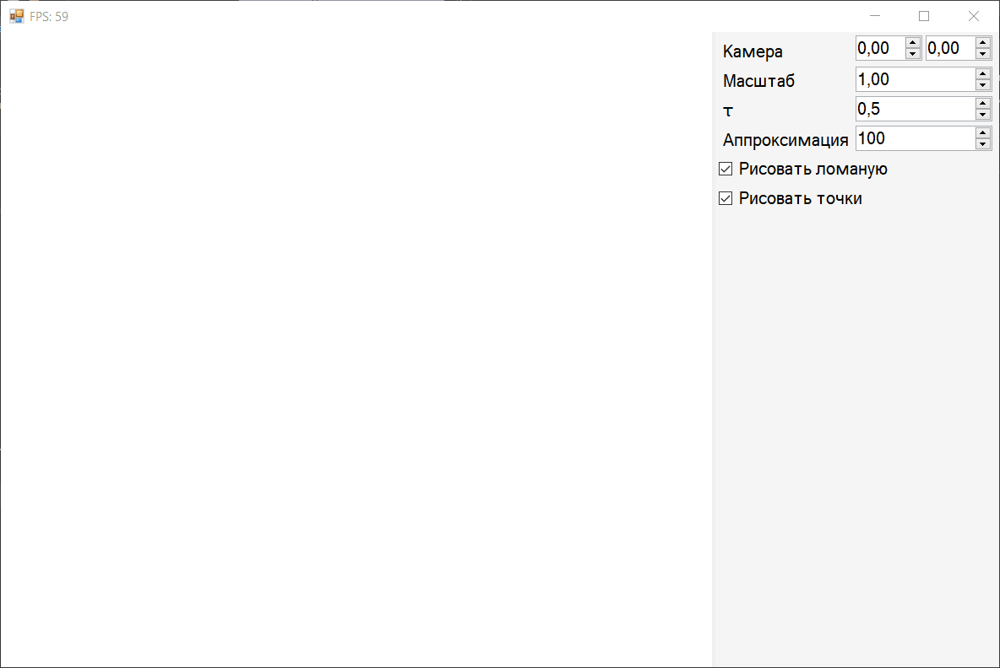

# Лабораторные работы по компьютерной графике

Название проекта | Вариант | Описание |
-----------------|---------|----------|
Lab1 | 8 |  |
Lab2 | 8 | Пятигранная прямая правильная призма |
Lab3, Lab4, Lab5 | 8 | Наклонный круговой цилиндр |
Lab6 | 8 | Прозрачность вершины обратно пропорциональна расстоянию от заданной точки |
Lab7 | 8 | Сегмент кривой Катмулла-Рома (Catmull-Rom) |
CourseWork | 8 | Линейная поверхность Кунса (границы – кубические кривые Безье 3D) |

Все работы выполнены на языке C# (.NET Framework, Windows Forms) с использованием библиотеки CGLabPlatform.

## Курсовая работа :mortar_board:

Линейная поверхность Кунса, границы – кубические кривые Безье. Можно вводить точки вручную, а можно загрузить из файла. Также можно сохранить введённые точки в файл. Задаётся 12 точек, лежащих на границе, по часовой стрелке.

## Лабораторная работа #1 :chart_with_upwards_trend:

Можно менять параметры графика, зумить, крутить, двигать мышкой. Крутится относительно реального центра картинки, при зуме меняется размер единичного отрезка. Зелёные границы помогают вписываться в размеры окна при их изменении.

## Лабораторная работа #2 :art:

Призма. Можно вращать и двигать мышкой. Двигается вслед за мышкой с помощью преобразования экранных координат курсора в мировые, что даёт очень хороший контроль над положением объекта. Также можно представить объект в различных проекциях.

## Лабораторная работа #3 :star:

Наклонный круговой цилиндр. Реализованы две модели освещения: плоская и Гуро. Можно менять цвет материала, интенсивность фонового света и точечного источника, восприимчивость материала к фоновому и диффузному освещению, зеркальность материала, рассеянность света точечного источника, коэффициенты затухания интенсивности с увеличением расстояния. Можно двигать источник света. Блики на поверхности зависят в том числе от положения наблюдателя, которое рассчитывается, исходя из поворота объекта.

## Лабораторная работа #4 :straight_ruler:

Наклонный круговой цилиндр на этот раз на OpenGL. Можно изменять параметр аппроксимации, сдвиг оснований, вращать камеру вокруг объекта мышкой, отдалять и приближать камеру.

## Лабораторная работа #5 :star2:

Модель освещения Фонга на GLSL. Все те же параметры, что и в третьей лабораторной, но интерполируется не цвет, как в модели Гуро, а нормали вершин, что выглядит заметно круче!

## Лабораторная работа #6 :sparkling_heart:

Реализация шейдерных эффектов на GLSL:
- два источника света вращаются сверху и снизу от объекта, красиво освещая его с разных сторон;
- прозрачность вершины обратно пропорциональна квадрату расстояния до заданной точки.

## Лабораторная работа #7 :black_nib:

Сплайн Катмулла-Рома. Можно устанавливать точки ЛКМ, удалять двойным нажатием ПКМ, двигать с зажатой ЛКМ, перемещаться по холсту с зажатой ПКМ, отдаляться и приближаться колёсиком мышки. Можно менять параметры аппроксимации и натяжения. Выполнена на OpenGL.

## Лицензии :shipit:
Весь мой код в этом репозитории рапространяется в соответствии с условиями лицензии MIT, но проект также использует библиотеку CGLabPlatform (лицензия [Beerware](https://fedoraproject.org/wiki/Licensing/Beerware)), которая содержит код [SharpGL](https://github.com/dwmkerr/sharpgl) (MIT).